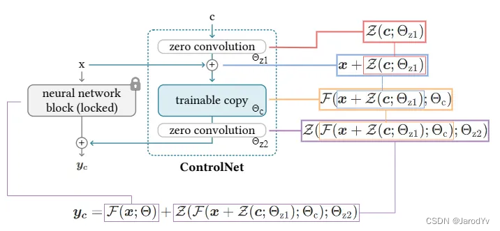
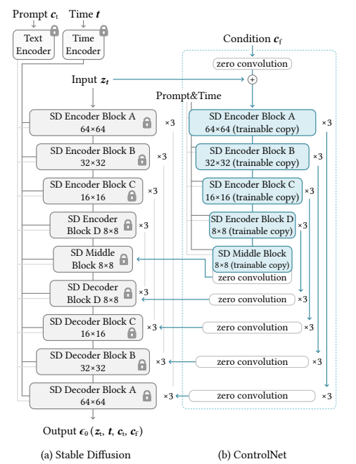
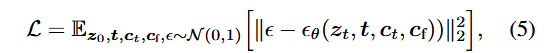
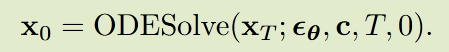
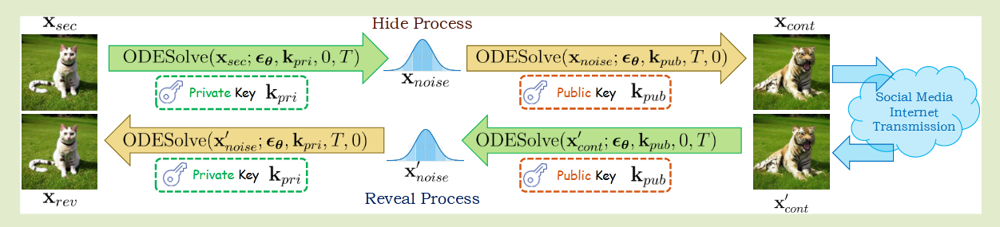
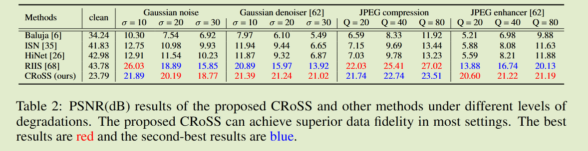

## latent diffusion
Latent Diffusion Models整体框架如图，首先需要训练好一个自编码模型（AutoEncoder，包括一个编码器和一个解码器）。这样一来，我们就可以利用编码器对图片进行压缩，然后在潜在表示空间上做diffusion操作，最后我们再用解码器恢复到原始像素空间即可，论文将这个方法称之为感知压缩（Perceptual Compression）。将高维特征压缩到低维，然后在低维空间上进行操作的方法具有普适性，可以很容易推广到文本、音频、视频等领域。
## Clip
CLIP的作用，就是将文本转换为语言信息并使其与图像信息在UNet中采用Cross Attention更好的偶合到一起，成为了***文本和图像***之间的连接通道。
# ControlNet
## ControlNet本体

 ControlNet向神经网络块注入了额外的条件。假设F（·；Θ）是这样的训练好的神经块，参数为Θ，它将输入特征图x转换为另一个特征图y。为了将ControlNet添加到预训练的神经块中，需锁定原始块的参数Θ，同时将块克隆到可训练的副本中，该副本具有参数Θ_c（如图2b）。可训练的副本接受外部条件向量c作为输入。当将这种结构应用于像Stable Diffusion这样的大型模型时，锁定参数可以保留使用数十亿张图像训练的生产就绪模型，而可训练的副本可以重用这种大规模预训练模型，以建立一个深、稳健且强大的主干网络来处理各种输入条件。  

<u>可训练的副本通过零卷积层Z（·；·）连接到锁定模型。具体而言，Z（·；·）是一个初始化为零的权重和偏差的1×1卷积层。为了构建ControlNet，使用两个零卷积的实例，参数分别为Θz1和Θz2。</u>

yc是ControlNet块输出。在第一个训练步骤中，由于零卷积层的权重和偏差参数都初始化为零，方程（2）中的两个Z（·；·）项都计算为零。这样在训练开始时，有害噪声不会影响可训练副本中神经网络层的隐藏状态。此外，由于Z（c；Θz1）=0，并且可训练副本也接收输入图像x，因此可训练副本完全有效，并保留大型预训练模型的功能，使其能够作为强大的主干网络用于进一步学习。零卷积通过消除初始训练步骤中的随机噪声来保护这个主干网络。
                        
## 以SD为baseline的ControlNet

使用ControlNet创建Stable Diffusion的12个编码块和1个中间块的训练副本。12个编码块分布在4个分辨率（64 × 64,32 × 32,16 × 16,8 × 8）中，每个分辨率复制3次。输出被添加到U-net的12个跳连接和1个中间块中。由于Stable Diffusion是典型的U-net结构，这种ControlNet架构可能适用于其他模型。
## Train

给定一个输入图像z0，图像扩散算法会逐步向图像添加噪声，并生成一个噪声图像zt，其中t表示添加噪声的次数。给定一组条件，包括时间步t、文本提示ct以及特定于任务的条件cf，图像扩散算法会学习一个网络εθ来预测添加到噪声图像zt上的噪声。  

训练过程需要将一半的ct置为空，有利于没有prompt的时候，更好的挖掘控制条件中的信息（例如边缘，深度等）

## method 1
通过软件生成隐藏图片的条件图。然后把条件图和隐藏图片都隐藏进去，最后提取，若有噪声，。。。。

# CRoSS: Diffusion Model Makes Controllable, Robust and Secure Image Steganography
条件扩散模型，基于DDIM Inversion，图像与潜在噪声之间存在可逆关系。

它只靠扩散模型来隐藏和提取秘密图像，所以保真度（PSNR）在不加噪声时就很低，加了一些噪声之后，同样是将宿主图形转化为噪声再生成秘密图像，所以保真度变化不大。